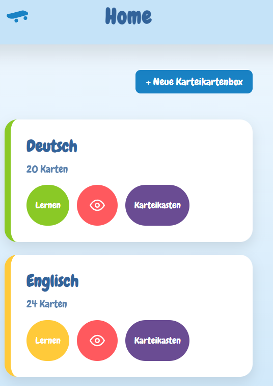
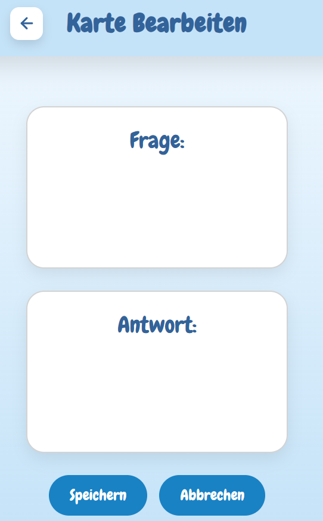
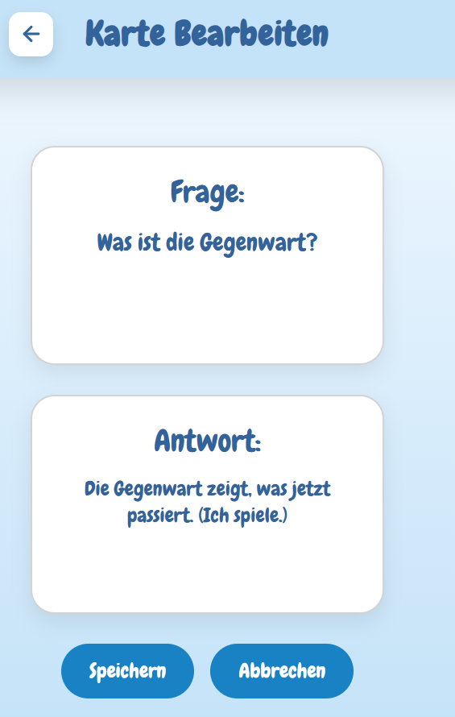
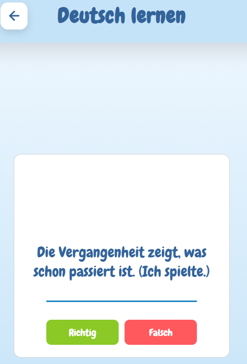
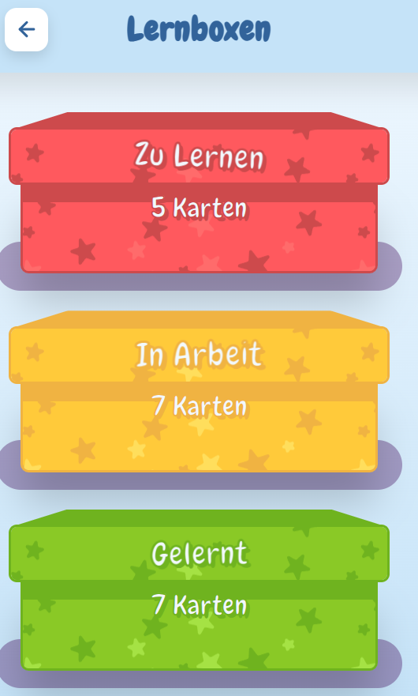
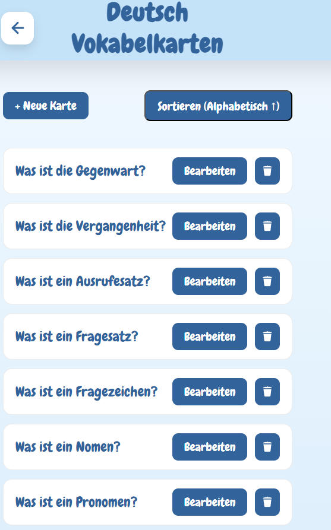

[](https://github.com/anne-kmmr/SubwaySurfers/actions/workflows/build-frontend.yml)
[](https://github.com/anne-kmmr/SubwaySurfers/actions/workflows/publish-frontend.yml)

# SubwaySurfers – Projektdokumentation

### **Hinweis:**  Matrikel-Nr: 8803009

Im Projekt steht in jeder Datei ganz oben der Name der Person, die den jeweiligen Teil umgesetzt hat. Da ich inzwischen der einzige im Team bin, muss lediglich der Code bewertet werden, bei dem Adam als Autor angegeben ist

## 1. Projektbeschreibung

### 1.1 Ziel des Projekts

SubwaySurfers ist eine Webanwendung zum Erstellen, Verwalten und Lernen von Vokabelkarten. Ziel des Projekts war die Entwicklung einer intuitiven und spielerischen Lernplattform, die insbesondere Kinder beim Lernen neuer Vokabeln unterstützt.

Die Anwendung ermöglicht es, verschiedene Karteikartenboxen anzulegen, Vokabelkarten zu erstellen und diese mithilfe eines Karteikastensystems zu lernen. Durch die Einteilung in verschiedene Lernstufen wird der Lernfortschritt gespeichert und der Nutzer kann sich gezielt auf noch nicht gelernte Karten konzentrieren.

---

## 2. Funktionen der Anwendung

Die Anwendung bietet folgende Funktionen:

* Erstellen neuer Karteikartenboxen
* Erstellen neuer Vokabelkarten
* Bearbeiten bestehender Karten
* Anzeige aller Karten eines Sets
* Lernmodus mit zufälliger Kartenauswahl
* Karteikastensystem mit drei Lernstufen
* Speicherung des Lernfortschritts in der Datenbank

### 2.1 Startseite



Die Startseite zeigt alle vorhandenen Karteikartenboxen an. Von dort kann der Nutzer:

* Zum Lernmodus.
* Zu den Karteikästen, in denen der Lernstatus angezeigt wird.
* Zur Listenansicht.
* eine neue Karteikartenbox erstellen

---

### 2.2 Neue Karteikartenbox erstellen

Beim Erstellen einer neuen Karteikartenbox wird zunächst lediglich der Name der Box gespeichert. Erst wenn die erste Karte erstellt wird, entsteht ein neues Set in der Datenbank. Dadurch werden keine leeren Karteikartenboxen gespeichert.

---

### 2.3 Neue Karte erstellen



Für jede Karte werden folgende Informationen eingegeben:

* Frage
* Antwort

Zusätzlich wird automatisch das aktuell ausgewählte Set übernommen.

Nach dem Speichern wird die Karte in der Datenbank gespeichert und erscheint sofort in der Kartenübersicht.

---

### 2.4 Karten bearbeiten



Bereits vorhandene Karten können bearbeitet werden.

Folgende Daten lassen sich ändern:

* Frage
* Antwort

Die Änderungen werden unmittelbar in der Datenbank gespeichert.

---

### 2.5 Lernmodus



Im Lernmodus wird jeweils eine zufällige Karte angezeigt.

Der Ablauf:

1. Frage lesen
2. Antwort anzeigen
3. Karte als richtig oder falsch bewerten
4. Lernstatus wird aktualisiert
5. Nächste Karte wird geladen

---

### 2.6 Karteikästen



Die Anwendung verwendet drei Lernstufen:

* **Zu Lernen (learning)**
* **In Arbeit (inProgress)**
* **Gelernt (learned)**

Zu jedem Karteikasten wird die aktuelle Anzahl der Karten angezeigt.

Beim Öffnen eines Karteikastens werden ausschließlich Karten des entsprechenden Lernstatus geladen.

### 2.7 Listenansicht



Nach dem Öffnen einer Karteikartenbox werden alle zugehörigen Vokabelkarten in einer übersichtlichen Listenansicht dargestellt.

Jeder Eintrag enthält die Frage und die zugehörige Antwort. Zusätzlich stehen Schaltflächen zum Bearbeiten der Karte sowie zum Öffnen des Lernmodus und der Karteikästen zur Verfügung.

Die Listenansicht bildet die zentrale Verwaltungsseite eines Sets und ermöglicht einen schnellen Überblick über alle vorhandenen Karten.
---

# 3. Entwicklungsumgebung

## Benötigte Software

Für die Entwicklung werden folgende Programme benötigt:

* Node.js
* npm

Die Anwendung ist betriebssystemunabhängig und kann unter Windows, Linux und macOS ausgeführt werden.

Falls das Projekt lokal gestartet werden soll, muss eine .env.local-Datei erstellt und mit einer eigenen Neon-Datenbank verbunden werden.

---

## Installation

Repository klonen:

```bash
git clone <Repository>
```

Projekt öffnen:

```bash
cd SubwaySurfers
```

Abhängigkeiten installieren:

```bash
npm install
```

---

## Anwendung starten

Nach erfolgreicher Installation genügt folgender Befehl:

```bash
npm run dev:all
```

Dadurch werden gleichzeitig

* das Next.js-Frontend
* das Express-Backend

gestartet.

Das Frontend ist anschließend unter

```
http://localhost:3000
```

erreichbar.

---

## Deployment

Die Anwendung wird über **Vercel** bereitgestellt.

Als Datenbank wird **Neon PostgreSQL verwendet.**

Für den Datenbankzugriff kommt **Drizzle ORM** zum Einsatz.

---

# 4. Projektstruktur

Das Projekt besteht aus drei Hauptbestandteilen.

## Frontend

Das Frontend wurde mit **Next.js** und **React** entwickelt.

Es übernimmt:

* Darstellung der Benutzeroberfläche
* Navigation
* Kommunikation mit dem Backend
* Formularvalidierung

---

## Backend

Das Backend wurde mit **Express.js** umgesetzt.

Es stellt REST-Endpunkte zur Verfügung, über die Karten erstellt, bearbeitet, geladen und aktualisiert werden.

Endpunkte:

* GET /vocab
* POST /saveCards
* PATCH /saveCards
* PUT /vocab
* GET /learningStatus

---

## Datenbank

Die Daten werden in einer Neon-Datenbank gespeichert.

Verwendete Technologien:

* Neon PostgreSQL
* Drizzle ORM

Die wichtigste Tabelle ist **vocabulary**.

Sie enthält unter anderem:

* id
* question
* answer
* set
* status

---

## Verwendete Technologien

* Next.js
* React
* TypeScript
* Express.js
* Neon
* Drizzle ORM
* CSS Modules

---

# 5. Webdesign

## Ziel des Designs

Das Design richtet sich vor allem an Kinder.

Aus diesem Grund wurde ein spielerisches Erscheinungsbild gewählt.

Wichtige Ziele waren:

* einfache Bedienung
* große Schaltflächen
* übersichtliche Navigation
* freundliche Farben
* wenig Ablenkung

Der Nutzer soll möglichst intuitiv durch die Anwendung geführt werden.

---

## Analyse der Startseite


### Kontrast

Wichtige Schaltflächen besitzen auffällige Farben und heben sich deutlich vom Hintergrund ab.

### Wiederholung

Buttons, Karten und Überschriften verwenden im gesamten Projekt dieselben Farben und Formen.

### Ausrichtung

Alle Elemente sind übersichtlich angeordnet und gleichmäßig ausgerichtet.

### Nähe

Zusammengehörige Informationen werden gemeinsam dargestellt.

---

## Analyse des Lernmodus


Im Lernmodus liegt der Fokus vollständig auf der aktuellen Karte.

Die großen Buttons „Richtig" und „Falsch" erleichtern die Bedienung.

Durch das Umdrehen der Karte entsteht ein spielerischer Lerneffekt.

---

# 6. Dokumentation der Eigenleistung

Meine Hauptaufgabe bestand in der Umsetzung der Listenansicht.

## Listenansicht

Ich entwickelte die Listenansicht der Karten, sodass alle Karten eines Sets übersichtlich angezeigt werden.

Hierfür wurde das Frontend mit den entsprechenden Backend-Endpunkten verbunden.

---

## POST-Endpunkt

Ich entwickelte den POST-Endpunkt zum Erstellen neuer Karten.

Dabei werden folgende Informationen gespeichert:

* Frage
* Antwort
* Set
* Lernstatus

Die Daten werden über Drizzle ORM in der Neon-Datenbank gespeichert.

---

## PATCH-Endpunkt

Zusätzlich entwickelte ich den PATCH-Endpunkt zum Bearbeiten vorhandener Karten.

Über diesen können Frage und Antwort einer bestehenden Karte geändert werden.

Nach erfolgreicher Aktualisierung werden die neuen Daten direkt in der Datenbank gespeichert.

Da derselbe Button sowohl zum Erstellen als auch zum Bearbeiten verwendet wird, wird zunächst geprüft, ob eine ID vorhanden ist. Ist eine ID vorhanden, wird der PATCH-Endpunkt aufgerufen. Andernfalls wird der POST-Endpunkt verwendet.

---

## Einbindung in das Projekt

Der Ablauf beim Erstellen einer neuen Karte sieht folgendermaßen aus:

1. Der Benutzer gibt Frage und Antwort im Frontend ein.
2. Das Frontend sendet eine POST-Anfrage an das Express-Backend.
3. Das Backend verarbeitet die Anfrage.
4. Drizzle ORM speichert die Daten in Neon.
5. Das Backend sendet eine Antwort zurück.
6. Das Frontend aktualisiert die Benutzeroberfläche.

Beim Bearbeiten einer Karte erfolgt derselbe Ablauf über den PATCH-Endpunkt.

---

## Entscheidungen

Während der Entwicklung wurden mehrere Entscheidungen getroffen.

Die Kommunikation zwischen Frontend und Backend erfolgt ausschließlich über REST-Endpunkte.

Für den Datenbankzugriff wurde Drizzle ORM verwendet, da dadurch typsichere Datenbankabfragen möglich sind.

Außerdem wurde entschieden, keine leeren Karteikartenboxen in der Datenbank zu speichern. Ein Set existiert erst, sobald mindestens eine Karte erstellt wurde.

---

## Herausforderungen

Während der Entwicklung traten verschiedene Probleme auf.

Unter anderem gab es Probleme mit der Datenbank-Sequence, da diese nicht mehr mit den vorhandenen IDs synchron war.

Außerdem musste die Übergabe des aktuellen Sets zwischen verschiedenen Seiten über URL-Parameter umgesetzt werden.

Eine besondere Herausforderung bestand darin, einen Großteil des Backends eigenständig zu entwickeln und mit dem Frontend sowie der Datenbank zu verbinden.

---

# 7. Fazit

Im Rahmen des Projekts entstand eine vollständige Webanwendung zum Erstellen und Lernen von Vokabelkarten.

Durch die Trennung von Frontend, Backend und Datenbank konnte eine übersichtliche Projektstruktur geschaffen werden.

Die Anwendung erfüllt alle grundlegenden Anforderungen:

* Erstellen von Karteikarten
* Bearbeiten bestehender Karten
* Verwaltung von Karteikartenboxen
* Lernmodus
* Speicherung des Lernfortschritts
* Datenhaltung über Neon

Zukünftige Erweiterungen könnten unter anderem eine Benutzerverwaltung, Statistiken zum Lernfortschritt oder zusätzliche Lernmodi umfassen.

